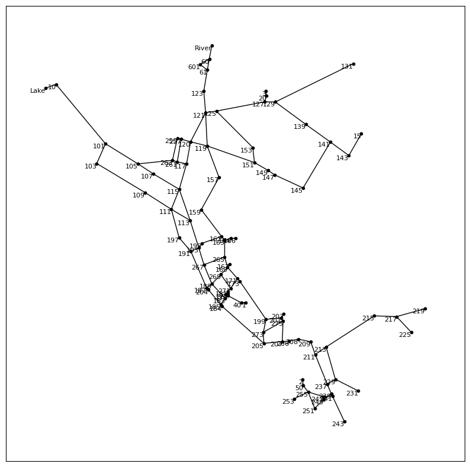
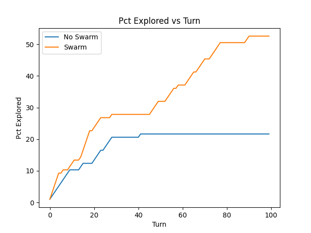

# Experiment 1
## Aim
To determine the effect of communication on the performance of agent exploration of the environment.

## Method
### Environment
The environment used is the Net3 environment - a representation of a real water pipe network. The environment has 97 nodes and 119 links. The environment is shown in the figure below.

### Agents
The number of agents used is 10. All agents start at the same location (the node: Lake). In the first simulation, agents do not collaborate/commuicate with each other. In the second simulation, agents do collaborate/communicate with each other according to the algorithms developed in the second iteration of the project.
### Simulation
The simulation is run for 100 turns. Details regarding each simulation are given in the simulation directories as config.json files.

## Analysis

The analysis script is analysis.py.

Plotting the results of the simulation, we get the following graph:

A number of observations can be made from the graph above:
* Communication between agents not only increases the total percentage of the environment explored, but also increases the speed at which the environment is explored.
* Looking at the case in which there is no collaboration between agents, we can see that the percentage of the environment explored by the agents caps at around 20% explored - this is due to the fact that when agents cannot communicate, they are designed to use only the base algorithm to explore the environment - the right-hand traversal algorithm. One of the weaknesses of this algorithm is that it can get stuck in a loop, and therefore not explore the entire environment. This is shown in the graph above, where the percentage of the environment explored by the agents caps at around 20% explored.
* Given that in the case of collaboration the percentage of the environment explored by the agents is much higher, we can conclude that communication between agents is able to mitigate the weakness of the right-hand traversal algorithm.