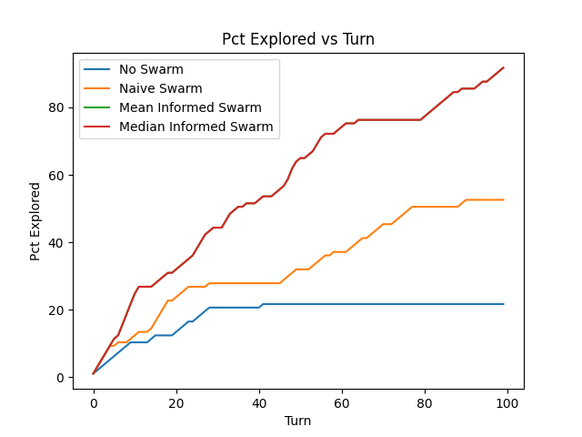

# Iteration 2 - Experiment 1

## Description
An initial experiment conducted to determine the effect of informed communication and swarm control on the performance of agents exploring the environment. Further testing will be done
in a later staage of the project.

## Aim
To determine the effect of informed communication and swarm control on the performance of agent exploration of the environment.

## Method
### Environment
The environment used is the Net3 environment - a representation of a real water pipe network. The environment has 97 nodes and 119 links. The environment is shown in the figure below.

### Agents
The number of agents used is 10. All agents start at the same location (the node: Lake). In the first simulation, agents do not collaborate/commuicate with each other. In the second simulation, agents do collaborate/communicate with each other according to the algorithms developed in the second iteration of the project.
### Simulation
The simulation is run for 100 turns. Details regarding each simulation are given in the simulation directories as config.json files.

## Analysis

The analysis script is analysis.py.

Plotting the results of the simulation, we get the following graph:

A number of observations can be made from the graph above:
* Using the informed task allocation method shows an increase in the efficieny of the agents in exploring the pipe network.
* The swarm was able to explore more of the environment more quickly when task allocation was informed vs naive task allocation.k